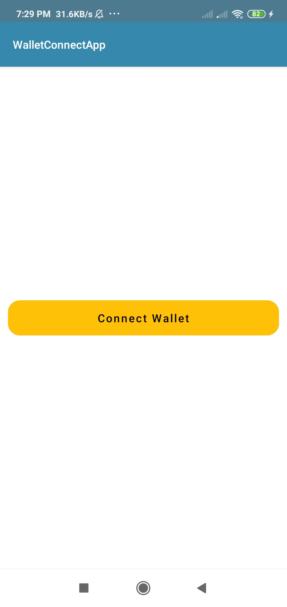
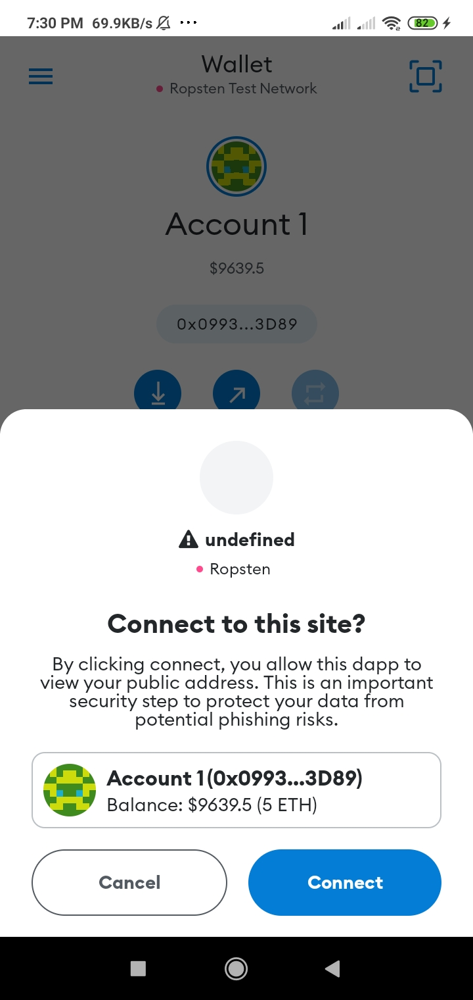
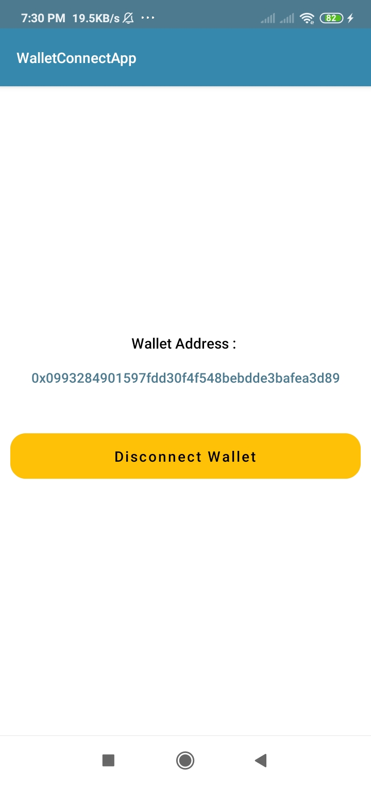

## Android WalletConnectApp
A simple android native Dapp that connect Crypto Wallet using Wallet Connect version 1.0 SDK

## Screenshot
connect wallet|select wallets|user approved|connected screen
:--:|:--:|:--:|:--:
|||

## References
- [WalletConnect](https://walletconnect.com/) - is an open protocol to communicate securely between Wallets (such as TrustWallet, MetaMask, etc.) and Dapps (Web3 Apps). The protocol establishes a remote connection between two apps and/or devices using a Bridge server to relay payloads. These payloads are symmetrically encrypted through a shared key between the two peers. The connection is initiated by one peer displaying a QR Code or deep link with a standard WalletConnect URI and is established when the counter-party approves this connection request. It also includes an optional Push server to allow Native applications to notify the user of incoming payloads for established connections.
- [WalletConnect v1.0 SDK](https://github.com/WalletConnect/kotlin-walletconnect-lib) - library to use WalletConnect with Kotlin or Java.
- [WalletConnect v1.0 documentation](https://docs.walletconnect.com/) - official wallet connect v1.0 documentation
